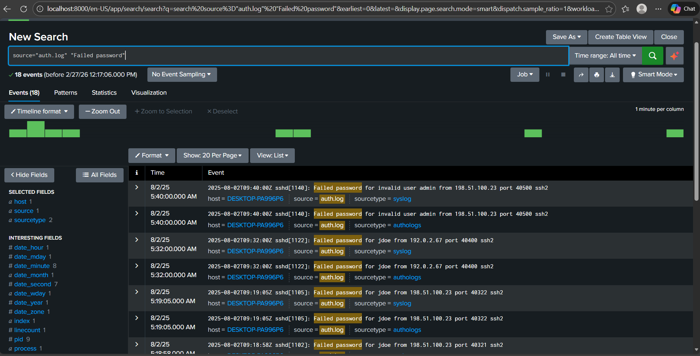
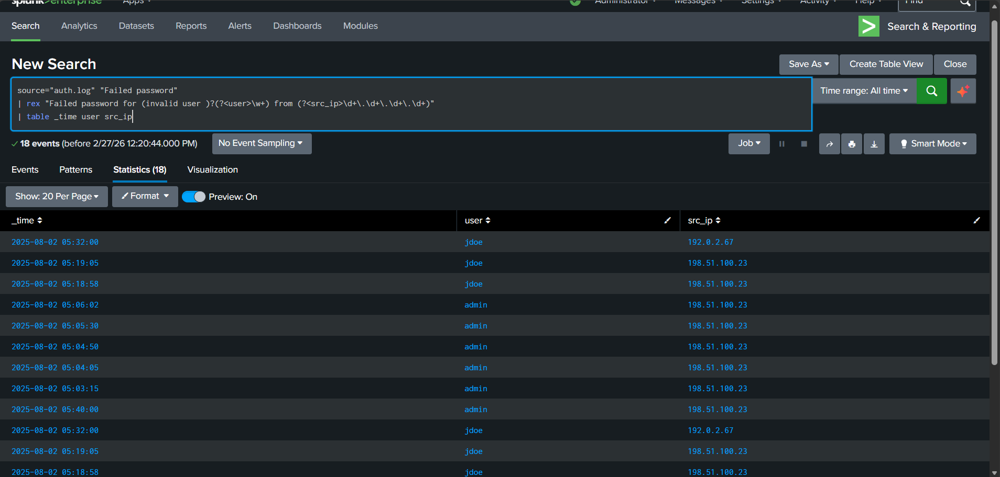
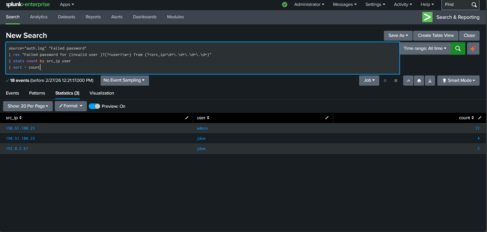

# SOC Alert Triage & Investigation (Splunk-style)

# SOC Alert Investigation — SSH Brute-Force Activity

## Overview
During log monitoring, repeated failed SSH authentication attempts were identified from a single external IP address targeting multiple user accounts.

Analysis showed automated login behavior consistent with a brute-force attack. A detection rule was created to identify repeated authentication failures from the same source.

## What I Did
- Reviewed authentication logs in Splunk
- Extracted usernames and source IP using field parsing
- Measured login frequency to confirm attack pattern
- Built a threshold-based detection rule
- Documented findings and recommended monitoring action

## Environment
SIEM: Splunk  
Log Source: Linux auth.log  
Attack Type: SSH brute-force attempt

## Detection Logic
Alert triggers when ≥5 failed login attempts originate from the same IP address.

## Result
The attacker source was identified and a reusable detection was created for SOC monitoring.

---

## Quick evidence (see images)

### Raw failed logins

### Parsed fields table

### Attack leaderboard

### Detection rule

### Alert logic / saved search

